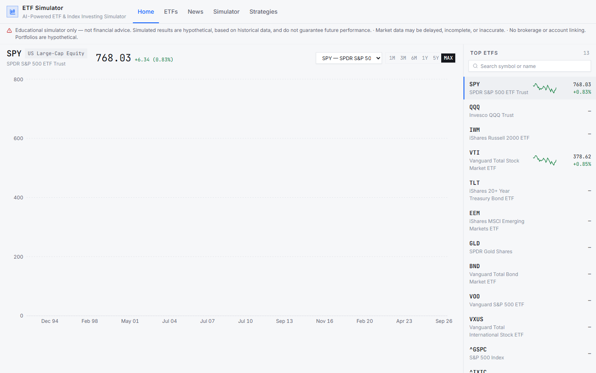
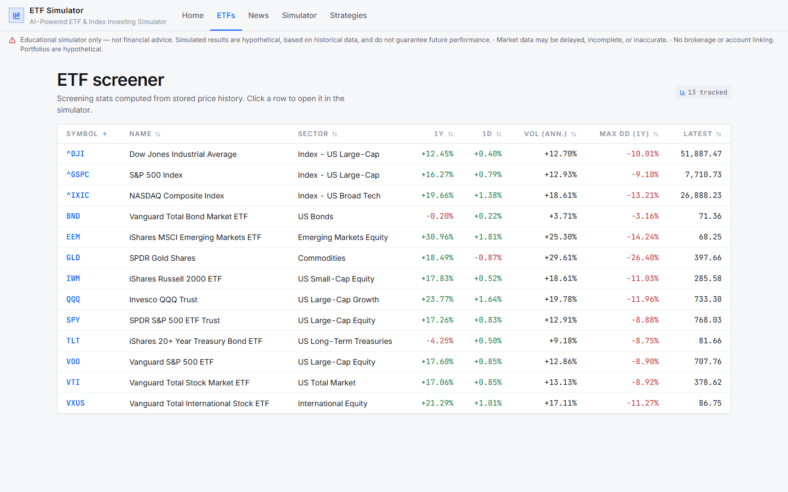
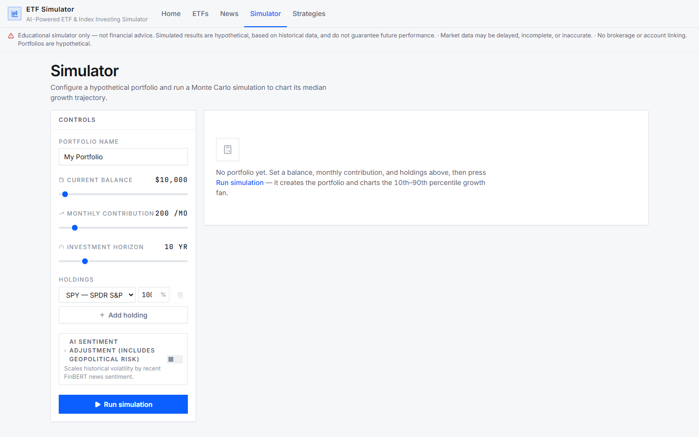

# AI-Powered ETF & Index Investing Simulator

An educational web application that simulates long-term ETF and index
investing strategies using historical market data, Monte Carlo simulation,
and financial/geopolitical news sentiment analysis. See
[PROJECT.md](PROJECT.md) for the full project spec, architecture decisions,
and phase plan, [docs/sentiment_validation.md](docs/sentiment_validation.md)
for the sentiment-signal validation results, and
[docs/ai_usage_log.md](docs/ai_usage_log.md) for the AI-assisted change log.

> **Educational simulator only.** This project does not provide financial
> advice. Simulated results are hypothetical and not a guarantee of future
> performance.

## Repository layout

```
backend/   FastAPI application, SQLite schema, DAO layer (Phases 0-3, 5-7)
frontend/  React (Vite) single-page app, routing, disclaimer banner (Phases 0, 4, 6, 8)
docs/      Sentiment-signal validation findings and the AI usage log
```

## Prerequisites

- Python 3.11+ (developed against 3.14)
- Node.js 20+ and npm

## Backend setup

```bash
cd backend
python -m venv .venv
.venv\Scripts\activate            # PowerShell on Windows
pip install -r requirements.txt  # runtime-only deps (no torch / yfinance)
copy .env.example .env            # fill in API keys when you add them
```

Three dependency sets are kept separate:

| File | Contents | Used for |
|---|---|---|
| `requirements.txt` | API + simulation runtime (FastAPI, uvicorn, numpy, pandas, ...) | Running the server; the Docker image installs only this |
| `requirements-ingest.txt` | runtime + yfinance, APScheduler, feedparser, scipy, torch, transformers | Local data ingestion + FinBERT sentiment scoring |
| `requirements-dev.txt` | runtime + pytest, httpx | Running the backend test suite |

The live API never imports the ingest stack (torch/transformers are imported
lazily), so the deployed server boots without them. Tests that exercise
ingest-only modules skip themselves automatically when those packages are
absent (`pytest.importorskip`).

Run the API server (defaults to http://127.0.0.1:8000):

```bash
uvicorn app.main:app --reload
```

- OpenAPI docs: http://127.0.0.1:8000/docs
- Health check: http://127.0.0.1:8000/health

On startup the app creates the SQLite database (`backend/simulator.db`) by
applying `backend/schema.sql` — unconditionally and idempotently
(`CREATE TABLE/INDEX IF NOT EXISTS`), so it is safe to run against an
existing database and restarting is safe. The schema includes indexes for
price lookups, simulation runs/results, and news sentiment (ticker+date and
category+date). Every DB connection applies `PRAGMA journal_mode=WAL`,
`PRAGMA busy_timeout=5000`, and `PRAGMA foreign_keys=ON` (these are
per-connection settings, not persisted by `schema.sql`).

## Market data ingestion (Phase 1)

A fixed catalog of ETFs/indices lives in
`backend/app/data/ticker_catalog.py`. To pull (or refresh) their full daily
close history into SQLite:

```bash
cd backend
python -m app.scripts.ingest                  # all tickers, full history
python -m app.scripts.ingest --symbols SPY QQQ --start 2020-01-01
```

Fetching is idempotent — re-running only inserts new trading days, never
duplicates. The API server also seeds the catalog on startup and (when
`ENABLE_SCHEDULER=true`) refreshes every day at `REFRESH_HOUR:REFRESH_MINUTE`
(see `.env.example`). One-off refreshes can be run at any time via the CLI.

## Backend API (Phase 3)

Interactive docs at http://127.0.0.1:8000/docs. From the browser the Vite
dev server exposes these via the `/api` prefix (e.g. `/api/tickers`).

| Method | Path | Purpose |
|---|---|---|
| GET | `/tickers` | Catalog + per-ticker price row counts and date range |
| POST | `/portfolios` | Create a config: name, monthly contribution, holdings (symbol + weight) |
| GET | `/portfolios` | List portfolios |
| GET | `/portfolios/{id}` | Portfolio detail with holdings |
| POST | `/portfolios/{id}/simulate` | Run a Monte Carlo simulation; params: `initial_balance`, `horizon_months`, `n_simulations`, optional `seed`/`blocks`, optional `use_sentiment` |
| GET | `/simulation-runs/{id}` | Fetch a cached run's results |

When a built SPA (`frontend/dist`, or the `FRONTEND_DIST` env override) is
present, the same server also serves the frontend at `/` with a client-side
fallback (unknown paths return `index.html`). All API routes are registered
before the fallback, so JSON endpoints are unaffected. This is what the Docker
deployment leverages (see [docs/deployment.md](docs/deployment.md)).

`POST .../simulate` caches identical parameter sets in SQLite
(`simulation_runs`/`simulation_results`), so repeated page loads don't
recompute. Re-running with identical params returns `"cached": true` and the
same `run_id`. Daily closes are resampled to monthly returns per holding,
combined with normalized weights into a portfolio return series, and fed to
the Phase 2 engine.

## Sentiment-adjusted simulation (Phase 5-6)

When `use_sentiment: true` is passed to `POST /portfolios/{id}/simulate`, the
service aggregates recent FinBERT-scored headlines (category `sector` or
`geopolitical`) into a sentiment score in `[-1, 1]` and maps it to a
volatility multiplier applied to the bootstrap return dispersion:

| Score | Volatility multiplier |
|---|---|
| -1.0 (very negative) | 1.10x (wider fan) |
| 0.0 (neutral) | 1.0x (no adjustment) |
| +1.0 (very positive) | 0.95x (narrower fan) |

The band is deliberately narrow — our validation (see
[docs/sentiment_validation.md](docs/sentiment_validation.md)) showed the
sentiment-to-volatility correlation is weak / mostly noise — while the
negative-vs-positive asymmetry is retained (leverage effect, Black 1976). The
response's `sentiment` block reports `applied`, the raw `score`, and the
`volatility_multiplier` so the UI can distinguish "adjusted" from
"neutral/absent". Sentiment runs are cached under a key that includes the
aggregate score, so fresh news never serves a stale run.

## Backend tests

The simulation engine (Phase 2) is a pure, API-independent module validated
against analytically solvable baselines (including the start-of-period
contribution-timing closed form, volatility drag, and bootstrap matching) plus
schema/database-connection integrity checks. The DAO and ingestion layers
(Phase 1) are tested against a temp SQLite file with mocked fetch output, so
tests never touch the network. The current suite is 181 tests run from
`backend/`:

```bash
cd backend
.venv\Scripts\activate        # or: python -m venv .venv once on first setup
pytest
```

## Frontend setup

```bash
cd frontend
npm install
npm run dev                      # http://localhost:5173
```

Vite proxies `/api/*` to the backend at `http://127.0.0.1:8000` (see
`frontend/vite.config.js`), so API calls from the browser can use relative
`/api/...` URLs with no CORS setup. Backend routes are exposed under `/api` in
dev; adjust `VITE_API_BASE_URL` in `frontend/.env.local` if you need a
different target.

Other commands:

```bash
npm run lint    # oxlint
npm run build   # production build to dist/
```

## Screenshots

The institutional light-theme UI. Every page at desktop (1440×900) and
mobile (390×844) widths lives in `docs/screenshots/light-theme/`;
dark-theme history is preserved under `docs/screenshots/before|after/`.







Focused keyboard states of every form control (selects, inputs, ranges,
toggles, sort buttons) are captured in `docs/screenshots/light-theme/controls/`.

## Deployment

See [docs/deployment.md](docs/deployment.md) for the single-container Docker
build (`etf-simulator`), the frozen-data snapshot procedure, environment
variables, and manual Fly.io / Railway deployment steps.

## Environment files

- `backend/.env` — backend settings (`DATABASE_URL`, API keys). Never commit.
- `frontend/.env.local` — Vite variables, `VITE_` prefixed only. Never commit.

Both have committed `.env.example` templates.

## Development workflow

- Build one phase at a time (see [PROJECT.md](PROJECT.md) section 5), commit,
  then move to the next.
- From Phase 1 on, SQLite access goes through a DAO/repository layer, never
  raw SQL in route handlers, so a future Postgres migration is a config
  change.